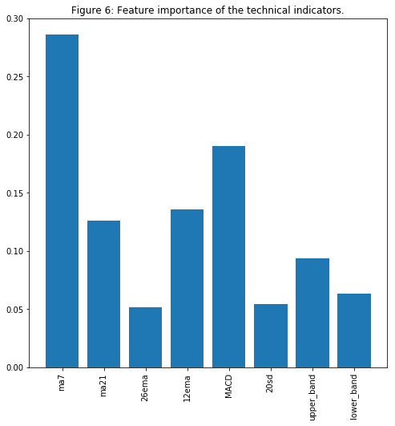

# Python script that uses latest achivements in AI to predict stock market movements

**Figure 1 - The overall architecture of my work**

```python
from utils import *

import time
import numpy as np

from mxnet import nd, autograd, gluon
from mxnet.gluon import nn, rnn
import mxnet as mx
import datetime
import seaborn as sns

import matplotlib.pyplot as plt
%matplotlib inline
from sklearn.decomposition import PCA

import math

from sklearn.preprocessing import MinMaxScaler
from sklearn.metrics import mean_squared_error
from sklearn.preprocessing import StandardScaler

import xgboost as xgb
from sklearn.metrics import accuracy_score
```


```python
import warnings
warnings.filterwarnings("ignore")
```


```python
context = mx.cpu(); model_ctx=mx.cpu()
mx.random.seed(1719)
```

**Note**: The purpose of this section (3. The Data) is to show the data preprocessing and to give rationale for using different sources of data, hence I will only use a subset of the full data (that is used for training).


```python
def parser(x):
    return datetime.datetime.strptime(x,'%Y-%m-%d')
```


```python
dataset_ex_df = pd.read_csv('data/panel_data_close.csv', header=0, parse_dates=[0], date_parser=parser)
```


```python
dataset_ex_df[['Date', 'GS']].head(3)
```


<div>
<style scoped>
    .dataframe tbody tr th:only-of-type {
        vertical-align: middle;
    }

    .dataframe tbody tr th {
        vertical-align: top;
    }

    .dataframe thead th {
        text-align: right;
    }
</style>
<table border="1" class="dataframe">
  <thead>
    <tr style="text-align: right;">
      <th></th>
      <th>Date</th>
      <th>GS</th>
    </tr>
  </thead>
  <tbody>
    <tr>
      <th>0</th>
      <td>2009-12-31</td>
      <td>168.839996</td>
    </tr>
    <tr>
      <th>1</th>
      <td>2010-01-04</td>
      <td>173.080002</td>
    </tr>
    <tr>
      <th>2</th>
      <td>2010-01-05</td>
      <td>176.139999</td>
    </tr>
  </tbody>
</table>
</div>


```python
print('There are {} number of days in the dataset.'.format(dataset_ex_df.shape[0]))
```

    There are 2265 number of days in the dataset.


Let's visualize the stock for the last nine years. The dashed vertical line represents the separation between training and test data.


```python
plt.figure(figsize=(14, 5), dpi=100)
plt.plot(dataset_ex_df['Date'], dataset_ex_df['GS'], label='Goldman Sachs stock')
plt.vlines(datetime.date(2016,4, 20), 0, 270, linestyles='--', colors='gray', label='Train/Test data cut-off')
plt.xlabel('Date')
plt.ylabel('USD')
plt.title('Figure 2: Goldman Sachs stock price')
plt.legend()
plt.show()
```


```python
num_training_days = int(dataset_ex_df.shape[0]*.7)
print('Number of training days: {}. Number of test days: {}.'.format(num_training_days, \
                                                                    dataset_ex_df.shape[0]-num_training_days))
```

```python
from statsmodels.tsa.arima_model import ARIMA
from pandas import DataFrame
from pandas import datetime

series = data_FT['GS']
model = ARIMA(series, order=(5, 1, 0))
model_fit = model.fit(disp=0)
print(model_fit.summary())
```

                                 ARIMA Model Results                              
    ==============================================================================
    Dep. Variable:                   D.GS   No. Observations:                 2264
    Model:                 ARIMA(5, 1, 0)   Log Likelihood               -5465.888
    Method:                       css-mle   S.D. of innovations              2.706
    Date:                Wed, 09 Jan 2019   AIC                          10945.777
    Time:                        10:28:07   BIC                          10985.851
    Sample:                             1   HQIC                         10960.399
                                                                                  
    ==============================================================================
                     coef    std err          z      P>|z|      [0.025      0.975]
    ------------------------------------------------------------------------------
    const         -0.0011      0.054     -0.020      0.984      -0.106       0.104
    ar.L1.D.GS    -0.0205      0.021     -0.974      0.330      -0.062       0.021
    ar.L2.D.GS     0.0140      0.021      0.665      0.506      -0.027       0.055
    ar.L3.D.GS    -0.0030      0.021     -0.141      0.888      -0.044       0.038
    ar.L4.D.GS     0.0026      0.021      0.122      0.903      -0.039       0.044
    ar.L5.D.GS    -0.0522      0.021     -2.479      0.013      -0.093      -0.011
                                        Roots                                    
    =============================================================================
                      Real          Imaginary           Modulus         Frequency
    -----------------------------------------------------------------------------
    AR.1           -1.7595           -0.0000j            1.7595           -0.5000
    AR.2           -0.5700           -1.7248j            1.8165           -0.3008
    AR.3           -0.5700           +1.7248j            1.8165            0.3008
    AR.4            1.4743           -1.0616j            1.8168           -0.0993
    AR.5            1.4743           +1.0616j            1.8168            0.0993
    -----------------------------------------------------------------------------


```python
from pandas.tools.plotting import autocorrelation_plot
autocorrelation_plot(series)
plt.figure(figsize=(10, 7), dpi=80)
plt.show() 
```


    <Figure size 800x560 with 0 Axes>


```python
from pandas import read_csv
from pandas import datetime
from statsmodels.tsa.arima_model import ARIMA
from sklearn.metrics import mean_squared_error

X = series.values
size = int(len(X) * 0.66)
train, test = X[0:size], X[size:len(X)]
history = [x for x in train]
predictions = list()
for t in range(len(test)):
    model = ARIMA(history, order=(5,1,0))
    model_fit = model.fit(disp=0)
    output = model_fit.forecast()
    yhat = output[0]
    predictions.append(yhat)
    obs = test[t]
    history.append(obs)
```


```python
error = mean_squared_error(test, predictions)
print('Test MSE: %.3f' % error)
```

    Test MSE: 10.151


```python
# Plot the predicted (from ARIMA) and real prices

plt.figure(figsize=(12, 6), dpi=100)
plt.plot(test, label='Real')
plt.plot(predictions, color='red', label='Predicted')
plt.xlabel('Days')
plt.ylabel('USD')
plt.title('Figure 5: ARIMA model on GS stock')
plt.legend()
plt.show()
```


```python
def get_feature_importance_data(data_income):
    data = data_income.copy()
    y = data['price']
    X = data.iloc[:, 1:]
    
    train_samples = int(X.shape[0] * 0.65)
 
    X_train = X.iloc[:train_samples]
    X_test = X.iloc[train_samples:]

    y_train = y.iloc[:train_samples]
    y_test = y.iloc[train_samples:]
    
    return (X_train, y_train), (X_test, y_test)
```


```python
# Get training and test data
(X_train_FI, y_train_FI), (X_test_FI, y_test_FI) = get_feature_importance_data(dataset_TI_df)
```


```python
regressor = xgb.XGBRegressor(gamma=0.0,n_estimators=150,base_score=0.7,colsample_bytree=1,learning_rate=0.05)
```


```python
xgbModel = regressor.fit(X_train_FI,y_train_FI, \
                         eval_set = [(X_train_FI, y_train_FI), (X_test_FI, y_test_FI)], \
                         verbose=False)
```


```python
eval_result = regressor.evals_result()
```


```python
training_rounds = range(len(eval_result['validation_0']['rmse']))
```

Let's plot the training and validation errors in order to observe the training and check for overfitting (there isn't overfitting).


```python
plt.scatter(x=training_rounds,y=eval_result['validation_0']['rmse'],label='Training Error')
plt.scatter(x=training_rounds,y=eval_result['validation_1']['rmse'],label='Validation Error')
plt.xlabel('Iterations')
plt.ylabel('RMSE')
plt.title('Training Vs Validation Error')
plt.legend()
plt.show()
```


```python
fig = plt.figure(figsize=(8,8))
plt.xticks(rotation='vertical')
plt.bar([i for i in range(len(xgbModel.feature_importances_))], xgbModel.feature_importances_.tolist(), tick_label=X_test_FI.columns)
plt.title('Figure 6: Feature importance of the technical indicators.')
plt.show()
```




# The result <a class="anchor" id="theresult"></a>


```python
from utils import plot_prediction
```

&nbsp;&nbsp;&nbsp;&nbsp;&nbsp;&nbsp;&nbsp;Finally we will compare the output of the LSTM when the unseen (test) data is used as an input after different phases of the process.

1. Plot after the first epoch.


```python
plot_prediction('Predicted and Real price - after first epoch.')
```


2. Plot after 50 epochs.


```python
plot_prediction('Predicted and Real price - after first 50 epochs.')
```


```python
plot_prediction('Predicted and Real price - after first 200 epochs.')
```


&nbsp;&nbsp;&nbsp;&nbsp;&nbsp;&nbsp;&nbsp;The RL run for ten episodes (we define an eposide to be one full GAN training on the 200 epochs.)


```python
plot_prediction('Final result.')
```


